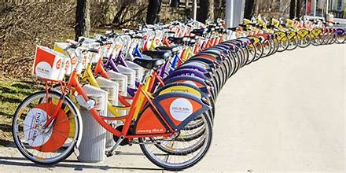

# [Bike Sharing Demand Prediction](https://drive.google.com/file/d/16TBLhy6aEuLKz0KiQCgVAM9wcZqoRBfW/view?usp=sharing)
## Table of Contents
- [Introduction](#introduction)
- [Problem Statement](#problem_statement)
- [Dataset](#dataset)
- [Installation](#installation)
- [Conclusion](#conclusion)

## Introduction
In modern urban cities, the introduction of rental bikes has significantly enhanced mobility and provided a convenient mode of transportation. To maximize the benefits of this service, it is essential to ensure that rental bikes are available and accessible to the public at the right time, thereby minimizing waiting times and improving user satisfaction.
A major challenge in this endeavor is maintaining a stable and sufficient supply of rental bikes across the city. This requires accurately predicting the number of bikes needed at each hour to meet demand. Effective prediction helps in ensuring that bikes are evenly distributed, reducing shortages and surpluses at various locations.

The key to achieving this lies in leveraging predictive analytics. By analyzing historical data and identifying patterns in bike usage, we can forecast the hourly demand for rental bikes. Factors such as weather conditions, time of day, day of the week, public events, and seasonal variations can be incorporated into the predictive model to enhance its accuracy.

## Problem_Statement
Rental bikes have become a cornerstone of enhanced mobility and convenience. Ensuring a stable supply of rental bikes at the right time and place is crucial to minimize waiting times and maximize user satisfaction. However, striking the right balance in bike supply is challenging. Excess bikes lead to wasted resources, including maintenance costs and parking space, while insufficient bikes result in revenue loss and potential long-term customer dissatisfaction.

To address this, our project aims to investigate key variables that influence the hourly demand for rental bikes and develop a predictive model to estimate the number of bikes required each hour. Our goals are to:

Maximize the availability of bikes to customers.
Minimize the waiting time for rental bikes.
Target Column: The number of bikes rented per hour.

## Dataset
The dataset used in this project is sourced from [here](https://drive.google.com/file/d/16TBLhy6aEuLKz0KiQCgVAM9wcZqoRBfW/view?usp=sharing) It comprises a comprehensive collection of information related to Airbnb bookings, including:

Input Columns (13 variables):

            1.Date :- Date-month-year
            2.Hour :- Hour of the Day
            3.Temperature (°C):- Temperature in Celsius
            4.Humidity (%) :- Humidity in percentage
            5.Wind speed (m/s):- Windspeed in m/s
            6.Visibility (10m):- Visibility in 10m
            7.Dew point temperature (°C):- due point temperature in Celsius 
            8.Solar Radiation (MJ/m²):- Solar radiation in MJ/m2
            9.Rainfall (mm):- Rainfall in mm
            10.Snowfall (cm):- Snowfall in cm
            11.Seasons:- >> Winter 
                         >> Spring
                         >> Summer
                         >> Autumn ]
            12.Holiday :- Wheather the day is considered a holiday or No holiday
            13.Functioning Day :- Whether the day is neither a weekend nor Holiday 
                              >> No- (non functional day)
                              >> Yes-(Functional day)

## Installation
To run this project on your local machine, follow these steps:

         Copy the colab file into your drive.

         Run the colab file to gain insights.

## Conclusion
The main goal of the project was to stablize bike demand at every hour. Based on the objective, it was found that:
The Random Forest model achieved an R-squared value of 0.82 on both the training and test sets, indicating that the model generalizes well and captures a significant portion of the variance in the target variable.

  Bike rental count is high during working days than on weekend.

  Bike demand shows peek around 8-9 AM in the morning and 6 - 7pm in the evening.

  People prefer to rent bike more in summer than in winter.

  Bike demand is more on clear days than on snowy or rainy days.

  Temperature range from 22 to 25(°C) has more demand for bike.

  The important feautures which plays a crucial role in deciding the number of rented bikes are {'Hour', 'Temperature(°C)', 'Humidity', 'Wind_speed','Visibility ', 'Solar_Radiation', 'Rainfall', 'Snowfall', 'Seasons'}
